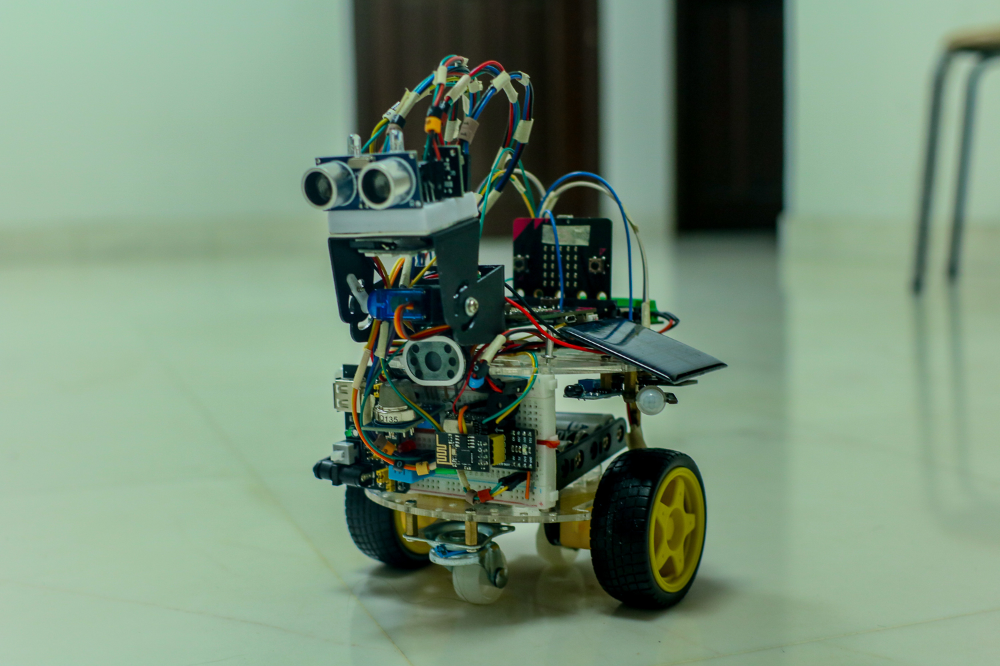
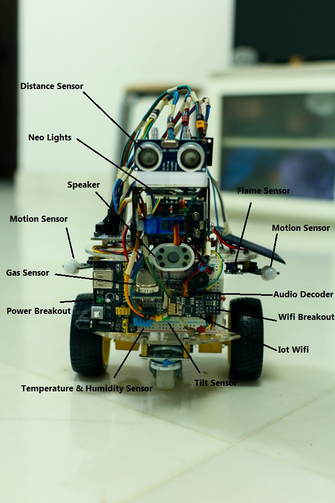
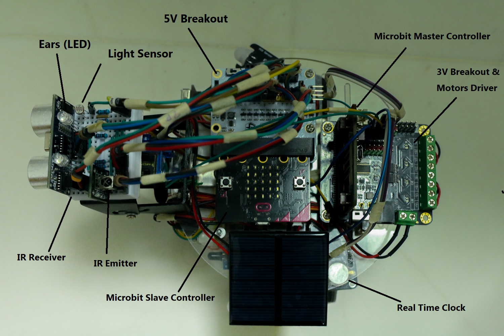
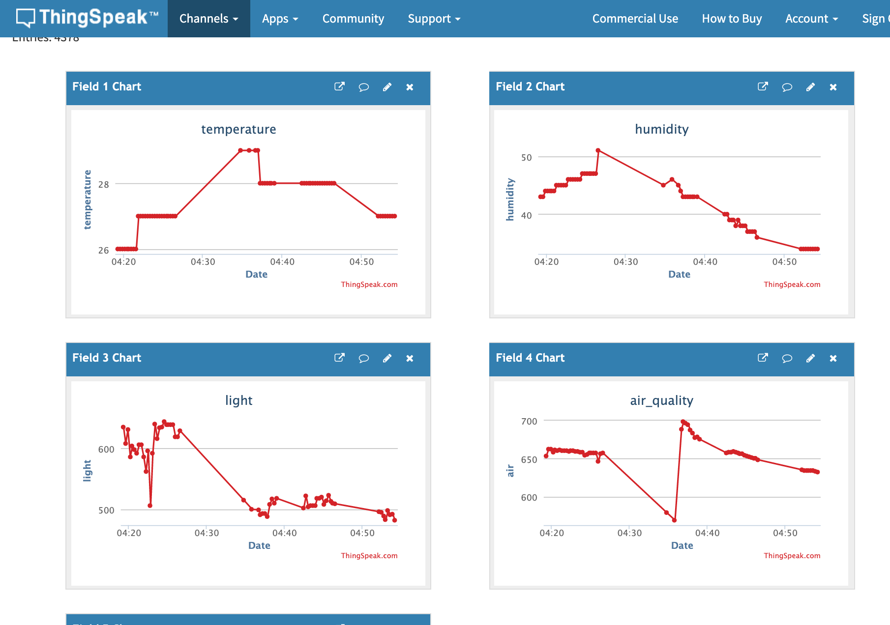

# Robot Athena

Source code of a little robot. It can :
- Collect environment data (temperature, humidity, air quality ,light, flame) and report to iot platform
- Free roam in the house and avoid walls and obstacles
- Detect and follow human motions 
- Make noises, play songs, open NeonLights and do some funny moves
- Run if it detects fire

